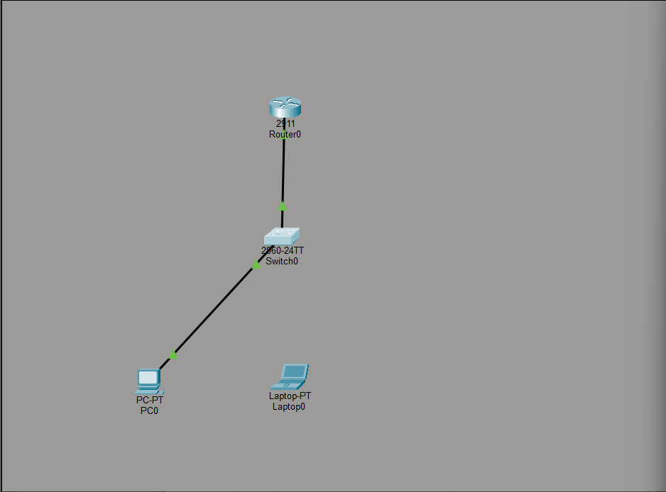
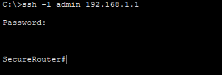
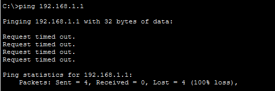
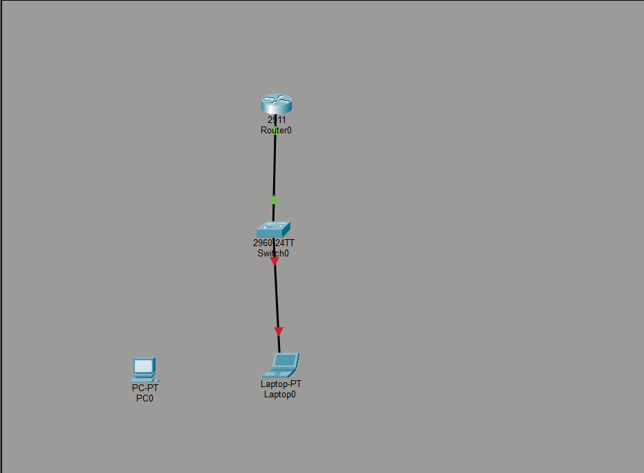
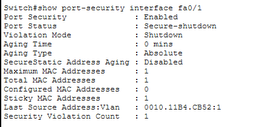

# 🛡️ Enterprise Network Hardening: SSH & Port Security Implementation

This project demonstrates the implementation of robust security measures at both the management and physical layers of a corporate network using Cisco IOS. The primary focus is on **Device Hardening** and **Layer 2 Security** to prevent unauthorized access and protect management traffic.

## 🏗️ Topology & Infrastructure
The network infrastructure is built upon the following components:
* **Router:** Cisco 2911 (Serving as the Secure Gateway)
* **Switch:** Cisco 2960 (Access Layer with Port Security enabled)
* **Management Domain:** `iztech.edu.tr`
* **Addressing:** IPv4 with `/24` CIDR notation.

## 🔐 Implemented Security Features

### 1. Secure Remote Management (SSHv2)
To replace insecure protocols like Telnet, **SSHv2** was implemented. This ensures that all administrative traffic between the Admin-PC and the Router is encrypted using **1024-bit RSA keys**, protecting credentials from network sniffing.

### 2. Layer 2 Port Security (Sticky MAC)
Physical security is enforced on switch ports using **MAC Address Sticky** technology.
* **Authorized Access:** Only the specific MAC address of the Admin-PC is permitted on the management port.
* **Violation Policy:** The port is configured to enter a `shutdown` state immediately upon detecting an unauthorized device frame.

---

## ✅ Verification & Proof of Concept (Step-by-Step)

The following sequence documents the successful implementation and triggering of the security policies.

### Phase 1: Baseline Operational State
The initial topology shows a healthy network where all authorized devices are connected and the link lights are green.

### Phase 2: Encrypted Administration
Verification of the SSH configuration. The Admin-PC establishes a secure, encrypted session with the **SecureRouter** CLI.

### Phase 3: Unauthorized Intrusion Attempt
An "Attacker Laptop" is physically connected to the secure port. Note that the switch waits for the first data frame (like a ping) before triggering the security violation.

### Phase 4: Active Mitigation (Violation Triggered)
As soon as the attacker attempts to communicate, the Switch identifies the unauthorized MAC address and kills the port. The link indicator turns **red**, signifying a security shutdown.

### Phase 5: Technical Audit & Logs
Technical confirmation from the Switch CLI showing the `Secure-shutdown` status and the recorded security violation count.

---

## 📁 Repository Structure
* `assets/`: Contains the technical evidence and screenshots used in this README.
* `Enterprise-Network-Hardening.pkt`: The Cisco Packet Tracer source file for simulation and review.
